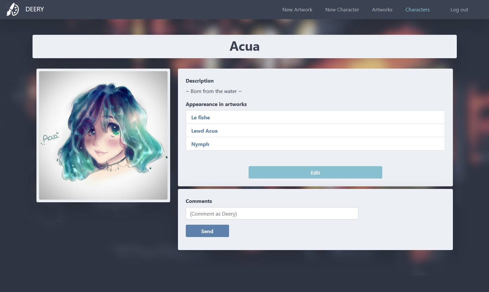

# [Deery](http://deeryx.herokuapp.com)

Deery is a web application, that serves as an artworks gallery or portfolio for a specific artist. It grants the owner a complete CRUD for their Artworks and Characters. 

Its name comes from the artist for whom the project was started: [Deery](https://www.instagram.com/_deeryx/) **(who owns all the Artworks and Characters that appear in the following screenshots)**.

## Artworks Gallery 🌸

## Visualize & Comment Artworks 💬

## Original Characters Gallery 🌸

## See the artworks where a specific character appear 🔗

## Sign Up & Sign In 👤

# [Development](http://deeryx.herokuapp.com)

## Colorscheme
Based in [Nord theme](https://www.nordtheme.com/) by [Arctic Ice Studio](https://github.com/arcticicestudio).

## Styling
Using [Bootstrap v5.0](https://getbootstrap.com/docs/5.0/getting-started/introduction/).

## Framework
Developed using [Spring Boot](https://spring.io/projects/spring-boot) JPA + [Hibernate](https://hibernate.org/).

## Data Persistency
[PostgreSQL](https://www.postgresql.org/) has been used for data persistency.

## Deployed
Using [Heroku](heroku.com).

## Current state: WIP
The project is NOT finished, some functionalities still need to be implemented.
